# Report 1

## Question 1: `mkdir ~/11712121`

- **mkdir** - make directories
- **~/11712121**: DIRECTORY
  - **~**: Home path
- Create the empty folder `11712121` in Home path, if they do not already exist.


## Question 2: `ls -la ~`

- **ls** - list directory contents
- **-a, --all**: do not ignore entries starting with.
- **-l**: use a long listing format
- Long format list (permissions, ownership, size and modification date) of all files
- show a list of information about all the file in the `~`(Home path)

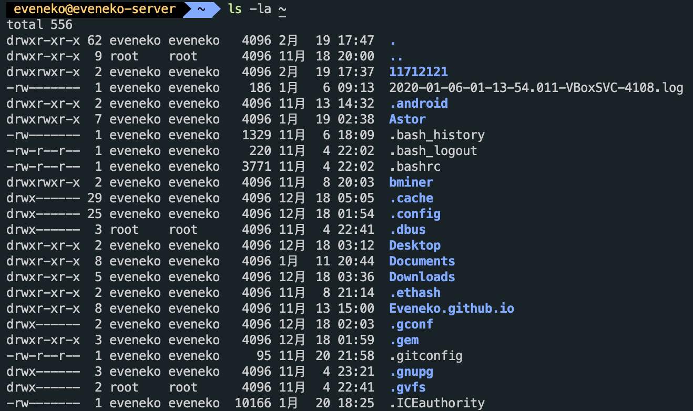

## Question 3: `cd ~/11712121`

- **cd** - Change Directory
- Change directory to `~/11712121`


## Question 4: `man grep`

- **man** - an interface to the on-line reference manuals
- **grep, egrep, fgrep, rgrep** - print lines matching a pattern
- **grep**  searches for PATTERN in each FILE. A FILE of “-” stands for standard input. If no FILE is given, recursive searches examine the working directory, and nonrecursive searches read standard input. By default, grep prints the matching lines.
- search for `grep`'s help manual

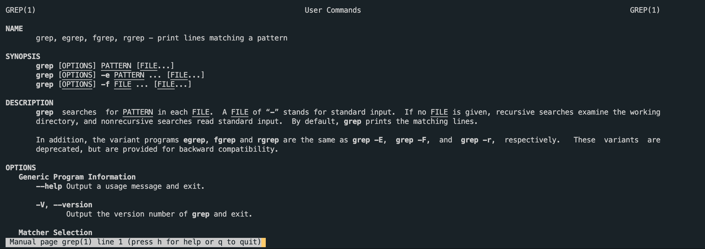

## Question 5: `sudo mv ~/11712121 /home & ls /home`

- **mv** - move (rename) files
- Rename SOURCE to DEST, or move SOURCE(s) to DIRECTORY
- ls - list directory contents - list directory contents
- move folder `~/11712121` to `/home` and list its contents

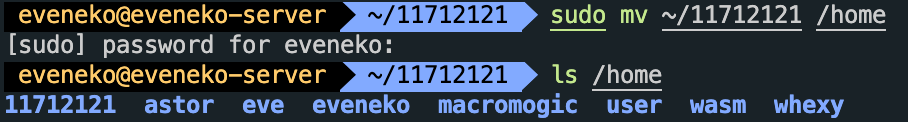

## Question 6: `sudo rm -r /home/11712121`

- **rm** - remove files or directories
- **-r, -R, --recursive** remove directories and their contents recursively
- delete all the contents in `/home/11712121` and this directory

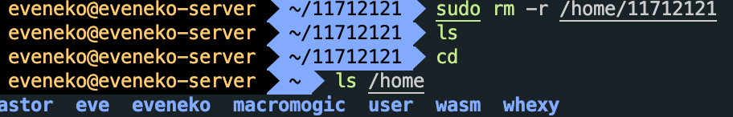

## Question 7: `sudo cp /etc/apt/sources.list /etc/apt/sources.list.bak`

- **cp** - copy files and directories
- copy the content in `/etc/apt/sources.list` to `/etc/apt/sources.list.bak`

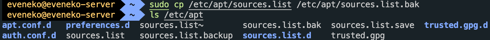

## Question 8: `cat /etc/shells`

- **cat** - concatenate files and print on the standard output
- print the contents in `/etc/shells` on shell, which means the shell you have

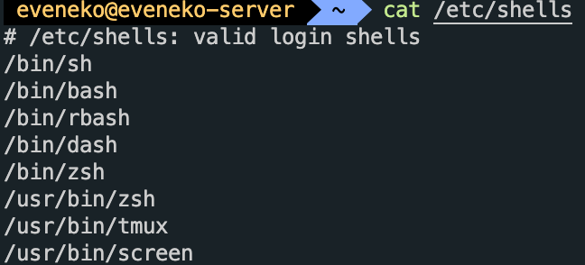

## Question 9: `cat /etc/shells | grep bash`

- `|` is the pipe, can only process correct information from the previous command
- print lines matching the pattern `bash` in `/etc/shells`

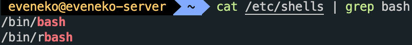

## Question 10: Open two terminals, find their PIDs by `ps` and kill one of them

- **ps** - report a snapshot of the current processes.
- `ps -ef | grep bash` search lines matching bash among the current processes.
- **kill** - send a signal to a process
- `kill xx` equals `kill -15 xx`, this signal means terminate(useless to kill bash)
- `kill -9 xx` - ILL (non-catchable, non-ignorable kill)
- kill the `bash` process

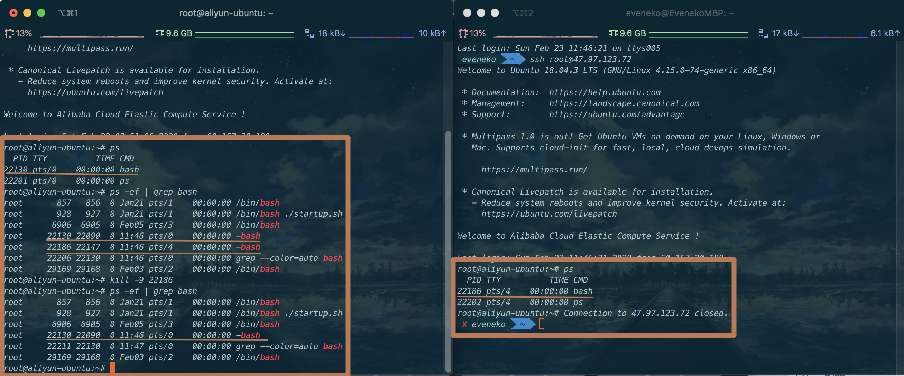

## Question 11

```c
#include <stdio.h>

int main(){
    int x = 0;
    x += 1;
    x += 1;
    x += 1;
    printf("%d\n", x);
    return 0;
}
```

- gcc
  - -S Stop after the stage of compilation proper; do not assemble.
  - -o filename Place output in file file. If no parameters, gcc will do all things and output an execute file a.out
  - -O optimization flags

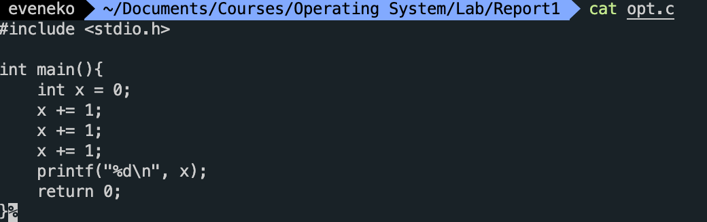

- do not optimize and get assembly code opt0.s
  - `gcc -S opt.c -O0 -o opt0.s`

- open the optimizer to get assembly code opt1.s
  - `gcc -S opt.c -O1 -o opt1.s`
- O1 optimization:
  - `-fdefer-pop`: Delay the pop time of the stack
  - `-fmerge-constants`: Try to merge the same constants across compilation units
  - `-fthread-jumps`: Optimize the order of branches
  - `-floop-optimize`: Perform loop optimization to remove constant expressions from the loop
  - `-fif-conversion`: Try to convert a conditional jump to the equivalent unbranched version.
  - `-fdelayed-branch`: This technique attempts to rearrange instructions based on instruction cycle time.
  - `-fguess-branch-probability`: The compiler uses a random pattern to guess the likelihood that a branch will be executed
  - `-fcprop-registers`: Because the registers are assigned to variables in the function, the compiler performs a second check to reduce scheduling dependencies (both segments require the same registers) and removes unnecessary register copy operations.
- Obviously, in the program, x plus 3 instead of x plus three 1.
  - `o0`: `addl $1, %eax`
  - `o1`: `movl $3, %esi`

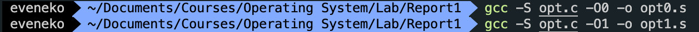

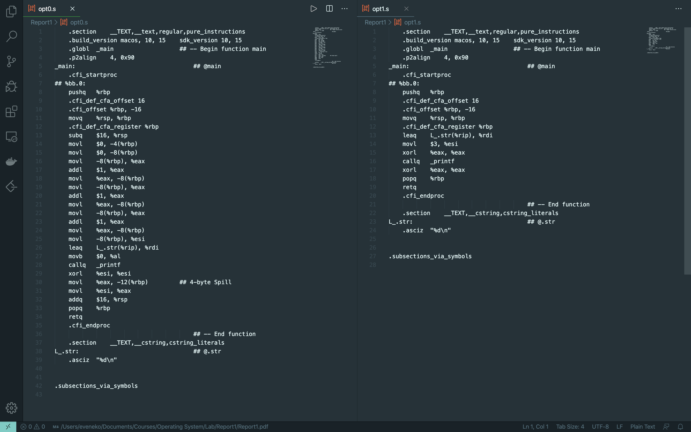
