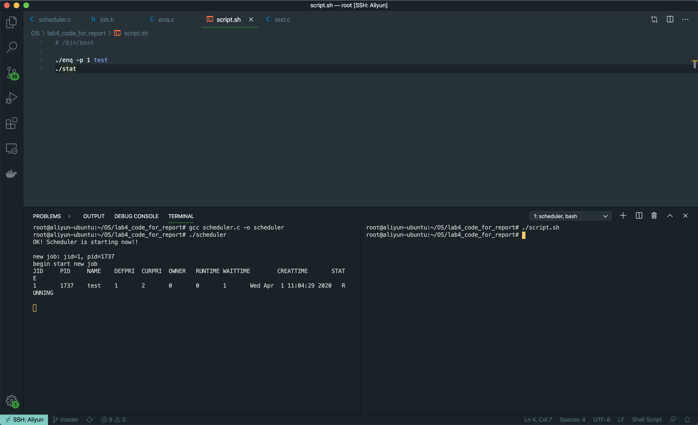
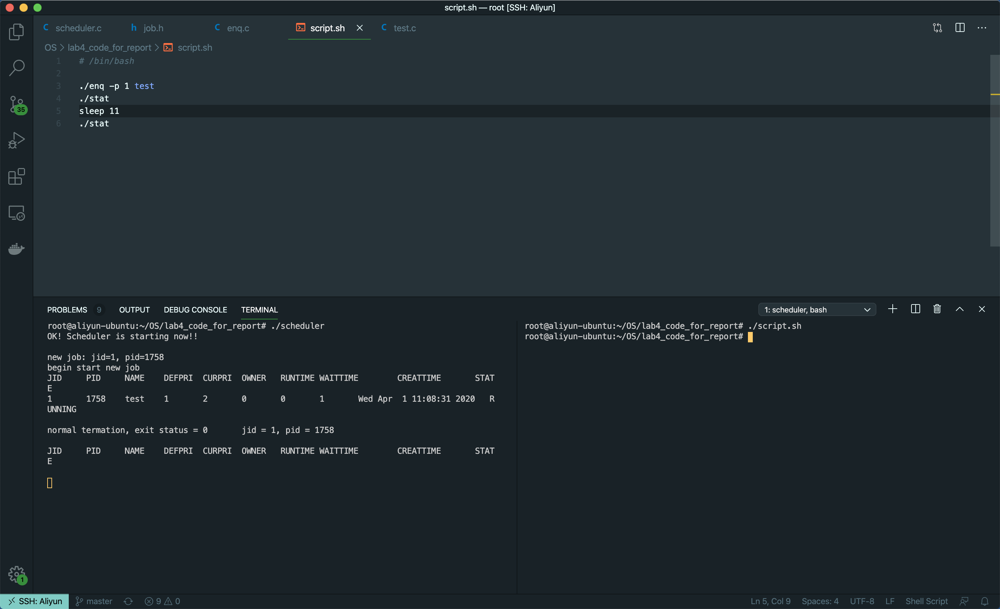
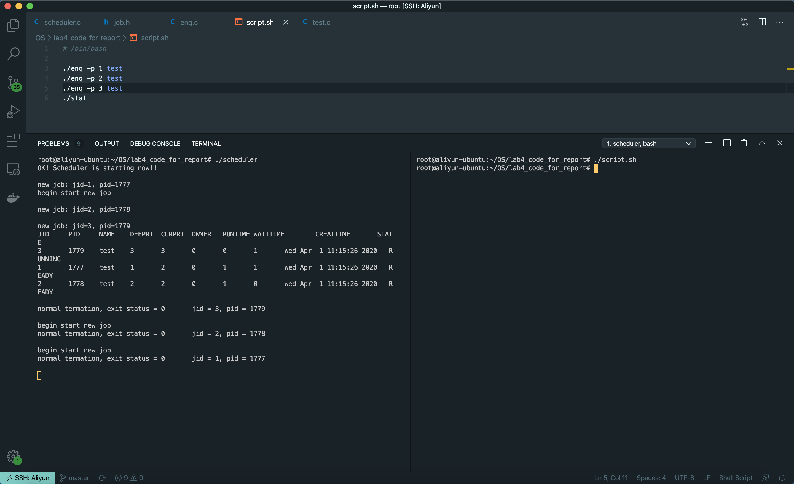
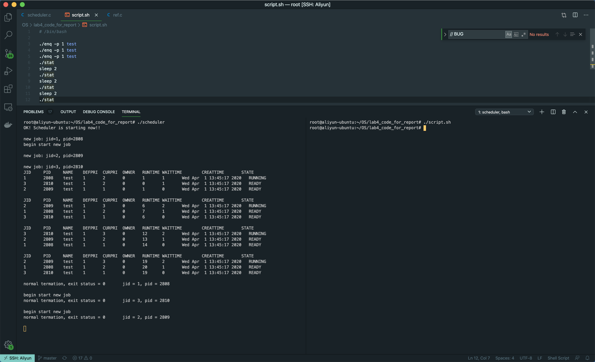

# Report 3

> What is a process? What is a program? And what is the difference?
> 说明进程与程序的区别：

- Process
  - an execution of certain program with its own address.
- Program
  - a group of static instructions to carry out a specified task.
- Difference
  - Process holds resources such as CPU, memory address, disk, I/O etc.
  - Process is an independent unit of the system for resource allocation and scheduling.
  - Program is stored on disk in some file and does not require any other resources.

> What is job? And what is the difference between process and job?
> 说明进程与作业的区别：

- Job
  - a series of program submitted to operating system for some goals.
- Process
  - an execution of certain program with its own address.
- Difference
  - Job is a unit of programs.
  - Job is a collection of work that a computer system requires a user to do during a transaction.
  - Process is actually the execution of a program (with address space).
  - Process is an independent unit of the system for resource allocation and scheduling.
  - A job may include multiple processes.

> What are the differences between job scheduling and process scheduling?
> 说明作业调度与进程调度的区别：

- Job scheduler is also called long term scheduler and Process scheduler is called short term scheduler.
- Job scheduler selects the processes from the job pool (Job pool is on the Hard disk) and load them in to the memory. It controls the degree of multi-programming.
- Under the condition that the resources are satisfied, job scheduling will transfer the ready jobs into memory, and simultaneously generate the processes corresponding to the jobs, and provide these processes with the required resources.
- Process scheduling follows a certain strategy selects among the processes which are ready for execution from the ready queue.

> What are the similarities and differences among structures, classes, and unions：
> 说明结构、类和联合的相同点和不同点：

- Similarities
  - They are user-defined data types in C Language.
  - They define a physically grouped list of variables that will be placed under one name in a memory block.
- Differences
  - The members in the classes are designed as private. But the members in the structures or unions are designed as public.
  - The members in the structures or classes are in the memory at the same time. But the unions only allow one member in the memory at the same time.

> How many statuses are in a job? And what are they?
> 本次实验作业有几种状态？请列举

There are three statuses: READY, RUNNING, DONE.

> What programs for job control are used in this experiment? And their function?
> 本实验作业控制命令处理程序包括哪些？它们分别实现什么功能？

- deq
  - Send a dequeue request to the scheduler
    - current jodid == deqid, terminate current job
    - maybe in waitqueue, search it
- enq
  - Send a enqueue request to the scheduler
  - Submit the job for
running.
- stat
  - Print out the following information of current running jobs and jobs in waiting queue on standard output
    - pid
    - user name
    - execution time
    - waiting time
    - create time
    - job status

> What is used for inter-process communication in this experiment? And its function?
> 本实验采用什么进行进程之间的通信？它相当于什么作用？

- Named pipe(FIFO) is used for inter-process communication in this experiment.(use for communicate between all components)
- Provide a method that deq, enq, and stat are able to communicate with the scheduler. They write the request in the FIFO file, and the scheduler reads the request in the FIFO file.

> What should be noted when printing out the job name:
> 在打印出作业名称的时候应该注意什么问题:

- The job name is cmdarg[0].
- Useing `%s` to format.

```c
if (current) {
  strcpy(timebuf,ctime(&(current->job->create_time)));
  timebuf[strlen(timebuf) - 1] = '\0';
  printf("%d\t%d\t%s\t%d\t%d\t%d\t%s\t%s\n",
    current->job->jid,
    current->job->pid,
    current->job->cmdarg[0],
    current->job->ownerid,
    current->job->run_time,
    current->job->wait_time,
    timebuf,
    "RUNNING" );
}

for (p = head; p != NULL; p = p->next) {
  strcpy (timebuf,ctime(&(p->job->create_time)));
  timebuf[strlen(timebuf) - 1] = '\0';
  printf("%d\t%d\t%s\t%d\t%d\t%d\t%s\t%s\n",
    p->job->jid,
    p->job->pid,
    p->job->cmdarg[0],
    p->job->ownerid,
    p->job->run_time,
    p->job->wait_time,
    timebuf,
    "READY" );
}
```

> Submit a job that takes more than 100 milliseconds to run（pleas paste your code）:
> 提交一个运行时间超过100毫秒的作业（请直接粘贴代码）:

```c
#include <stdio.h>
#include <unistd.h>

// 一个运行时间超过100毫秒的作业
int main(){
    for(int i = 0; i < 10; ++i){
        printf("This is %d iteration, pid is %d\n", i, getpid());
        sleep(1);
    }
    return 0;
}
```

> List the bugs you found and your fix(Describe the cause of bugs in detail and how to modify it)：
> 列举出你找到的bug并给出你的解决方案（请仔细描述bug的原因以及修复方案）：

1. BUG：编译错误。

   - 原因：错用中文分号。

   - 修复方案：替换成英文分号。

   - 修复代码：

      ```c
      for (p = head; p != NULL; p = p->next) {
          p->job->wait_time += 1; // BUG：中文分号
      }
      ```

2. BUG：时间分片错误

   - 参考

   ```c
   struct itimerval
   {
     /* Interval for periodic timer */
     struct timeval it_interval;
     /* Time until next expiration */
      struct timeval it_value;
   };
   struct timeval
   {
     time_t      tv_sec;         /* seconds */
     suseconds_t tv_usec;        /* microseconds 1/1000000 seconds */
   };

   ```

   - 原因：setitimer设置定时器时间错误，单位是微秒不是毫秒。

   - 修复方案：按照注释要求改为100ms。

   - 修复代码：

   ```c
   /* timer interval: 0s, 100ms */

     interval.tv_sec = 0;
     interval.tv_usec = 100000;  // BUG：单位是微秒（百万分之一秒）

     new.it_interval = interval;
     new.it_value = interval;
     setitimer(ITIMER_VIRTUAL,&new,&old);
   ```

3. BUG：连续执行超过3次 `./enq -p 3 test`（`test` 是运行时间为10s的job），只有jid1和jid2完成了。

   - 原因：`select->next` 没有设为 `NULL`，导致成环。

   - 修复方案：在 `jobselect()` 和 `do_deq` 在搜索完最高优先级的job之后，分别处理在第一个节点搜索到最大优先度的任务和在中间搜索到最大优先度的任务。并如果有搜索到，将 `select->next` 设为 `NULL`。（`jobselect()` 和 `do_deq`修改相同）

   - 修复代码：

   ```c
       if (select == selectprev){
         head = head->next;
       }else{
         selectprev->next = select->next;
       }
       if(select){
         select->next = NULL;
       }
   ```

4. BUG：未实现“如果优先级最高，则优先级最高的作业先运行优先，等待时间最长的工作优先”。

   - 原因：未实现“Priority add 1 after waiting for 100ms”，未实现等待时间长的工作优先。（未切换）

   - 修复方案：在 `updateall()` 中，job的 `curpri` 小于3的时候，`curpri` 加一。

   - 修复代码：

    ```c
    struct waitqueue* jobselect()
    {
      struct waitqueue *p, *prev, *select, *selectprev;
      int highest = -1;
      int highest_wait = -1;

      select = NULL;
      selectprev = NULL;

      if (head) {
        for (prev = head, p = head; p != NULL; prev = p, p = p->next) {

          if (p->job->curpri > highest) {
            select = p;
            selectprev = prev;
            highest = p->job->curpri;
            highest_wait = p->job->wait_time;
          }
          else if (p->job->curpri == highest) {
            if (p->job->wait_time > highest_wait) {
              select = p;
              selectprev = prev;
              highest_wait = p->job->wait_time;
            }
          }
        }

        if (select == selectprev){
          head = head->next;
        }else{
          selectprev->next = select->next;
        }
        if(select){
          select->next = NULL;
        }
      }

      return select;
    }
    ```

5. BUG：只执行一次 `enq -p 1 test`（`test` 是运行时间为10s的job），job无法停止，无返回。

- 原因：子进程的 `raise(SIGSTOP);` 在父进程的 `kill(current->job->pid, SIGCONT);` 之后执行。所以子进程在其他进程运行前（提交前）都是 `Stopped` 的。

- 修复方案：在 `do_enq()` 中， 父进程添加 `waitpid(-1, NULL, WCONTINUED);` ，确保先 `raise(SIGSTOP);` 在 `kill(current->job->pid, SIGCONT);` 之前。

- 修复代码：

```c
} else {
    waitpid(-1, NULL, WCONTINUED);
    newjob->pid = pid;
    printf("\nnew job: jid=%d, pid=%d\n", newjob->jid, newjob->pid);

  }
```

> Run the job scheduler program, And analyze the execution of the submitted job:
> 运行作业调度程序，分析提交作业后的作业的执行过程:

- 建立一个作业就绪队列，每个作业都提交到就绪队列中。
- scheduler遍历队列，找到优先级最高都作业，并执行。
- 一个作业每等100ms，当前优先级加1，最高为3。
- 若当前运行的作业时间片到了，使其暂停执行，将其放入就绪队列中，当前优先级恢复为初始优先级。

> Understand the process of job scheduling——Submit a new job (Execution results and corresponding code)：
> Schedueler作业调度的过程理解——提交新作业 （执行结果及代码表现）：

- 提交一个新作业，为其创建一个进程
- 设置它的状态为READY
- 然后放到就绪队列里面



> Understand the process of job scheduling——End of job execution (Execution results and corresponding code)： 
> Schedueler作业调度的过程理解——作业正常执行结束 （执行结果及代码表现）：

- 将作业从链表中删除
- 打印作业完成语句



> Understand the process of job scheduling——job scheduling due to Priority(Execution results and corresponding code)：
> Schedueler作业调度的过程理解——因为优先级和进行作业调度（执行结果及代码表现）

- scheduler遍历队列所有作业，找到优先级最高都作业，并执行100ms时间片。
- 优先级比较的标准是 `curpri`。



> Understand the process of job scheduling——Job scheduling due to time slice (Execution results and corresponding code)：
> Schedueler作业调度的过程理解——因为时间片而进行作业调度（执行结果及代码表现）：

- 设置时间片为100ms，意味着在100ms内，该作业一直执行。
- 在时间片到期后或者该作业执行结束，会重新进行调度。



> 实验总结：

- 深刻理解了作业调度的问题和整个流程
