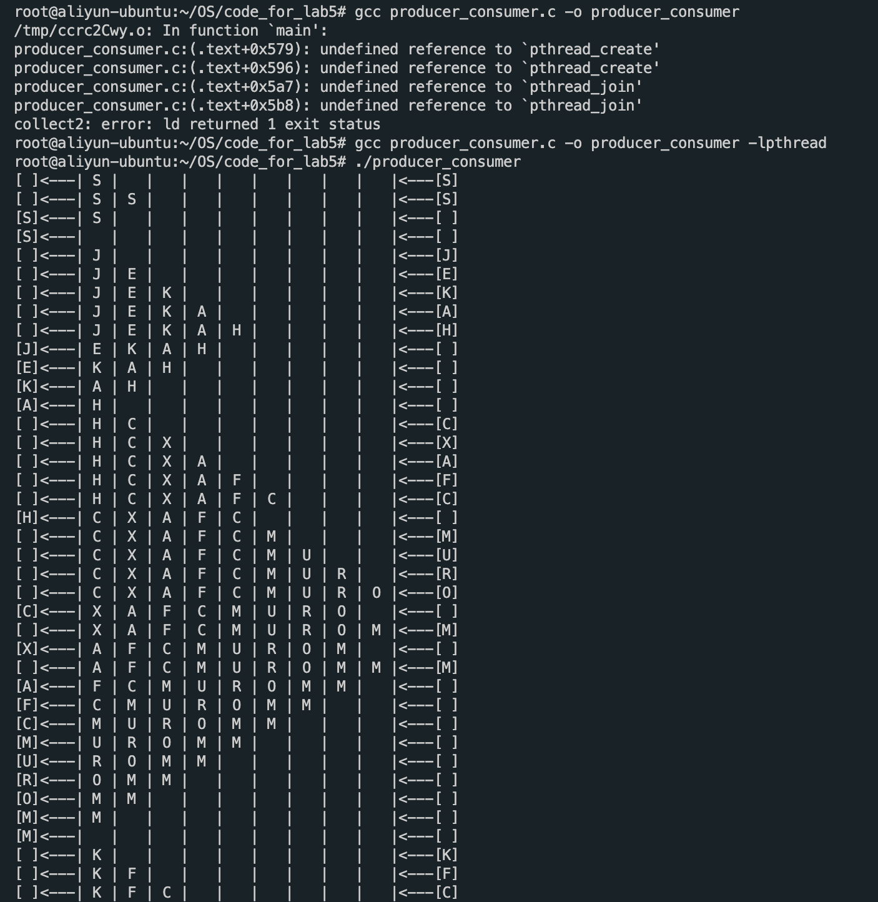

# Report4

> Describe Function(功能) of pthread_create:

- pthread_create的功能是创建线程（实际上就是确定调用该线程函数的入口点），在线程创建以后，就开始运行相关的线程函数。
- pthread_create的返回值 表示成功，返回0；表示出错，返回-1。

> Describe Function(功能) of pthread_join:

- pthread_join用来等待一个线程的结束，线程间同步的操作。
- pthread_join()函数，以阻塞的方式等待thread指定的线程结束。当函数返回时，被等待线程的资源被收回。如果线程已经结束，那么该函数会立即返回。并且thread指定的线程必须是joinable的。
- 0代表成功。 失败，返回的则是错误号。

> Describe Function(功能) of pthread_mutex_lock:

- 当pthread_mutex_lock()返回时，该互斥锁已被锁定。
- 线程调用该函数让互斥锁上锁，如果该互斥锁已被另一个线程锁定和拥有，则调用该线程将阻塞，直到该互斥锁变为可用为止。

> Describe Function(功能) of pthread_cond_wait:

- 条件变量是利用线程间共享的全局变量进行同步的一种机制，主要包括两个动作：一个线程等待"条件变量的条件成立"而挂起；另一个线程使"条件成立"（给出条件成立信号）。
- 为了防止竞争，条件变量的使用总是和一个互斥锁结合在一起。
- 无条件等待pthread_cond_wait()，必须和一个互斥锁配合，以防止多个线程同时请求pthread_cond_wait()的竞争条件。
- 且在调用pthread_cond_wait()前必须由本线程加锁（pthread_mutex_lock()），而在更新条件等待队列以前，mutex保持锁定状态，并在线程挂起进入等待前解锁。在条件满足从而离开pthread_cond_wait()之前，mutex将被重新加锁，以与进入pthread_cond_wait()前的加锁动作对应。

> Describe Function(功能) of pthread_cond_signal:

- pthread_cond_signal函数的作用是发送一个信号给另外一个正在处于阻塞等待状态的线程,使其脱离阻塞状态,继续执行。
- 如果没有线程处在阻塞等待状态,pthread_cond_signal也会成功返回。

> Describe Function(功能) of pthread_mutex_unlock:

- pthread_mutex_unlock是可以解除锁定 mutex 所指向的互斥锁的函数。

> Describe Function(功能) of sem_open:

- sem_opne函数的功能是创建并初始化有名信号量或打开一个已存在的有名信号量。

> Describe Function(功能) of sem_wait:

- sem_wait函数的功能是从信号量的值减去一个“1”，但它永远会先等待该信号量为一个非零值才开始做减法。
- 如果对一个值为0的信号量调用sem_wait()，这个函数就会原地等待直到有其它线程增加了这个值使它不再是0为止。

> Describe Function(功能) of sem_post:

- sem_post函数的功能是给信号量的值加上一个“1”，它是一个“原子操作”，即同时对同一个信号量做加“1”操作的两个线程是不会冲突的。

> Describe Function(功能) of sem_close:

- sem_clode函数的功能是关闭有名信号量。

> Producer-Consumer Problem（understand producer_consumer.c）: Are the data that consumers read from the buffer are produced by the same producer?

<!-- - 不一定
- 如果可能有多个生产者和消费者（将每次while相当于一个新的consumer和producer，看作每个生产者只生产一件商品，每个消费者只消费一件商品），消费者从buffer读取的内容可能来自多个生产者。
- 如果只有一个生产者和消费者（根据代码，pthrea_create()只创建了一个生产者和消费者，每次while其实都是一个线程，看作一个生产者生产多个商品，一个消费者消费多个商品），消费者从buffer读取的内容来自同一个生产者。 -->

- 是的
- 在main程序中，只调用了一次pthrea_create()创建了一个生产者，只调用了一次pthrea_create()创建了一个消费者
- 在consumer和producer里面，是一个while循环，看作一个生产者生产多个商品，一个消费者消费多个商品
- 所以消费者消费的商品全部来自同一个生产者

> Producer-Consumer Problem（understand producer_consumer.c）: What is the order of the consumer's read operations and the producer's write operations, and their relationship

- 生产者的写入操作在消费者的读取操作前。
- 当生产者写入操作时，发现buffer已满时，会等待。
- 当生产者写入操作时，发现buffer已空时，会写入，并发送信号（告诉消费者可以读取了）。
- 当消费者读取操作时，发现buffer已满时，会读取，并发送信号（告诉生产者可以写入了）。
- 当消费者读取操作时，发现buffer已空时，会等待。

> Producer-Consumer Problem（understand producer_consumer.c）: Briefly describe the result of the program

- 创建两个进程，分别是生产者和消费者
- 一个mutex互斥锁配合两个条件锁（条件变量）来保证线程同步，读写安全。
- 生产者随机产生一个字母写进buffer。
- 消费者从buffer读取一个字母。
- 当生产者写入操作时，发现buffer已满时，会等待。
- 当生产者写入操作时，发现buffer已空时，会写入，并发送信号（告诉消费者可以读取了）。
- 当消费者读取操作时，发现buffer已满时，会读取，并发送信号（告诉生产者可以写入了）。
- 当消费者读取操作时，发现buffer已空时，会等待。
- 在每个读取，写入的环节，程序会在stdout里面打印当前读取/写入情况和buffer内容。
- 生产者和消费者根据SLEEP_CHANCE和SLEEP_TIME随机进行睡眠。
- 

> Producer-Consumer Problem（understand producer_consumer.c）: What queue is used in this program, and its characteristics?

- 在这个程序中，使用环状队列来实现FIFO。
- 环状队列初始化队列大小和头尾指针。
- 在写入和读取的过程中，buffer内的元素不需要进行移动，变化的只有头尾指针。这样提高速度，节约内存。

> Producer-Consumer Problem（understand producer_consumer.c）: Briefly describe the mutual exclusion mechanism of this program

- 一个互斥锁和两个条件锁（条件变量）来保证线程同步，读写安全。
- 互斥锁保证一个线程在读写的时候，另一个进程不在操作。
- empty条件锁保证当buffer为空的时候，无法读取，阻塞等待。
- full条件锁保证当buffer满的时候，无法写入，阻塞等待。
