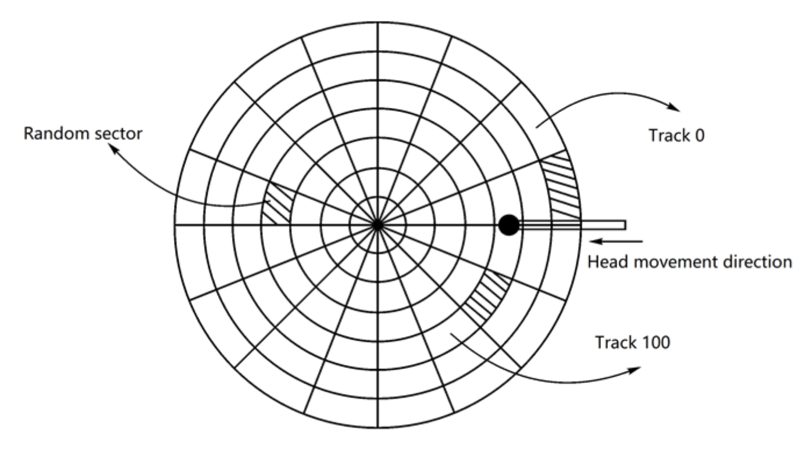

# Report8

1. 填空题

    I/O control methods can be classified as (1)**\_\_Programmed IO\_\_**(2)**\_\_DMA(Direct Memory Access)\_\_**.

    Each physical record on the disk has a unique address that consists of three parts: (1)**\_\_Head Identifier\_\_**(2)**\_\_Track Identifier\_\_**(3)**\_\_Sector Identifier\_\_**.

    Data READ/WRITE time = (1)**\_\_Seek Time\_\_** + (2)**\_\_Rotational Latency\_\_** +(3)**\_\_Transfer Time\_\_**.

    The metric for measuring I/O performance are (1)**\_\_Response Time\_\_**,(2)**\_\_Throughput\_\_**.

2. What are the work steps of the DMA controller? Please answer it and briefly describe the process of each step

    1. device driver is told to transfer disk data to buffer at address X
    2. device driver tells disk controller to transfer C bytes from disk to buffer at address X
    3. disk controller initiates DMA transfer
    4. disk controller sends each byte to DMA controller
    5. DMA controller transfers bytes to buffer X, increasing memory address and decreasing C until C = 0
    6. when C = 0, DMA interrupts CPU to signal transfer completion

3. Under what circumstance, the SSTF algorithm will cause starvation?

    SSTF scheduling is essentially a form of shortest-job-first (SJF) scheduling; and like SJF scheduling, it may cause starvation of some requests.

    Remember that requests may arrive at any time.

    Suppose that we have two requests in the queue, for cylinders 14 and 186, and while the request from 14 is being serviced, a new request near 14 arrives. This new request will be serviced next, making the request at 186 wait. While this request is being serviced, another request close to 14 could arrive. In theory, a continual stream of requests near one another could cause the request for cylinder 186 to wait indefinitely.

4. Suppose the computer system uses the disk as the following:
   
   Let a single-sided disk rotation speed be 12000r/min, each track has 100 sectors, 200 tracks in total, and the average movement time between adjacent tracks is 1 ms.

   If at some point, the head is located at track 100 and moves in the direction in which the track number increases, the track number request queue is 70, 90, 30, 120, 20, 60. For each track in the request queue, a randomly distributed sector is read.

   a) If the C-SCAN algorithm is used to read the six sectors,

    (1) Write the track access sequence (5 points)

    100 --> 120 --> 199 --> 0 --> 20 --> 30 --> 60 --> 70 --> 90

    (2) How much time is required in total? The calculation process is required. (15 points).

    Because of randomly distributed sector, rotating to the correct sector need half cycle

    Seek time: ((199 - 100) + (90 - 0) + (199 - 0)) * 1ms = 388ms

    Rotational latency: 6 * 0.5r / (12000r/min / 60000ms/min) = 15ms

    <!-- Transfer time: 6 * (1/100) / (12000r/min / 60000ms/min) = 0.3ms -->

    Total = Seek time + Rotational latency = 403ms

   b) If using SSD, which scheduling algorithm do you think should be used, and explain why? (10 points)

   If using SSD, I think FCFS scheduling algorithm should be used, because SSD doesn't have moving part like head. So that seek time and rotational latency should not be considered.
